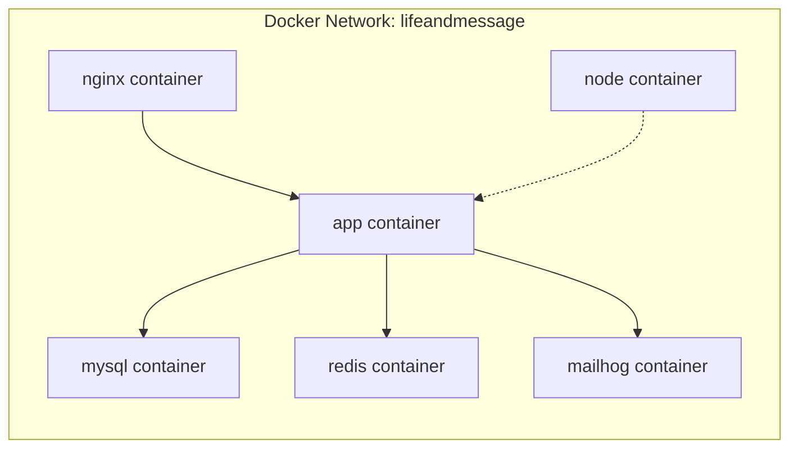
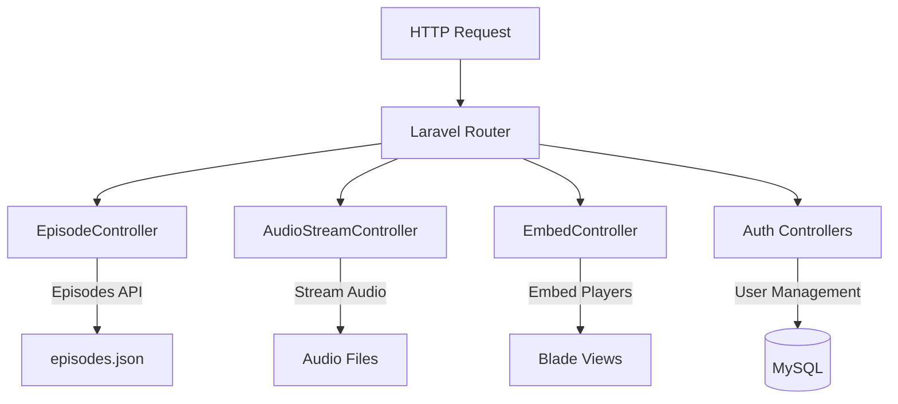
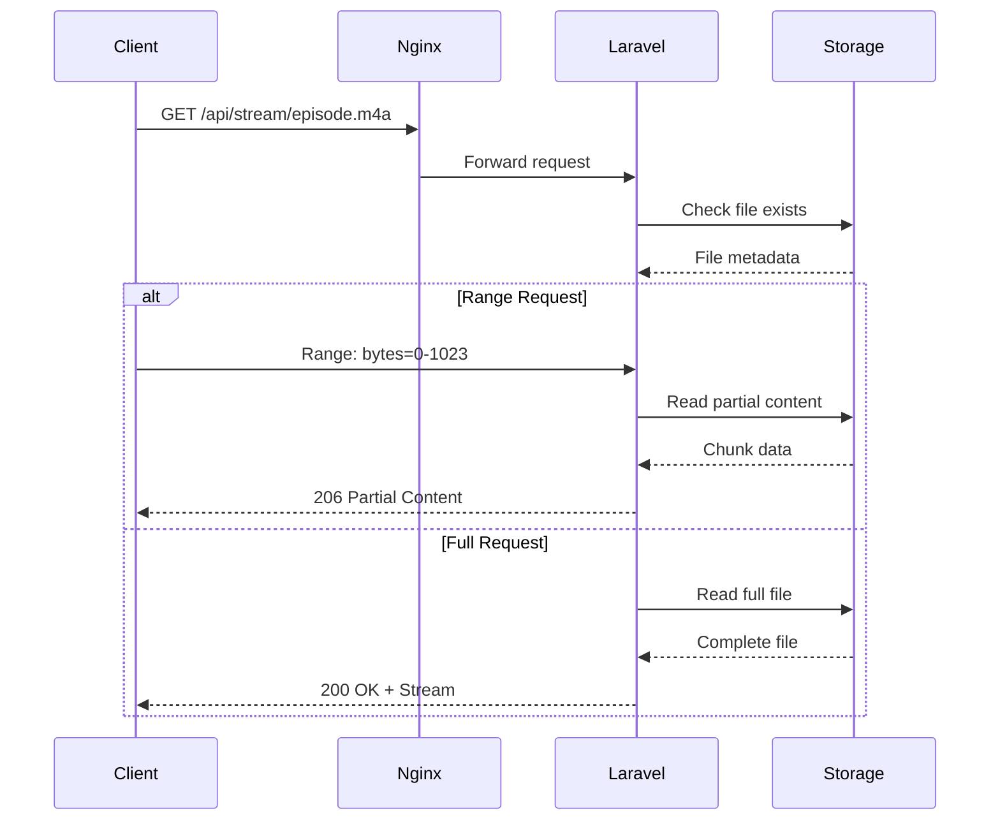
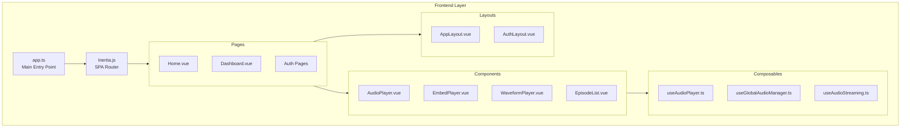
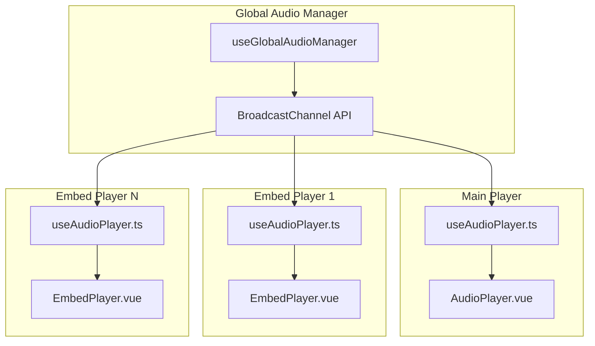
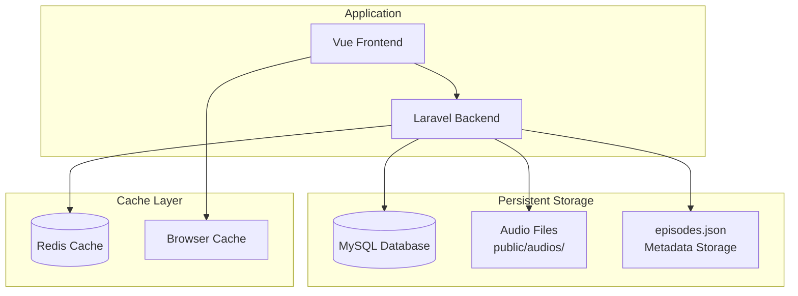
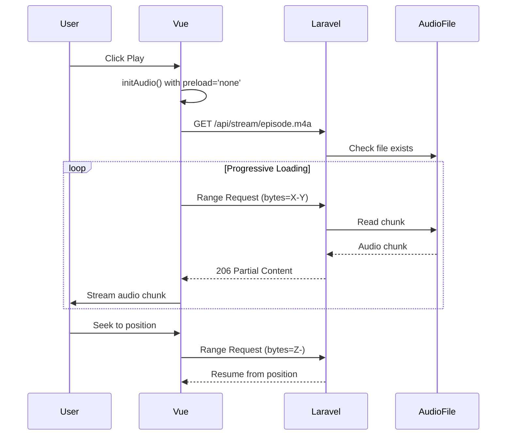
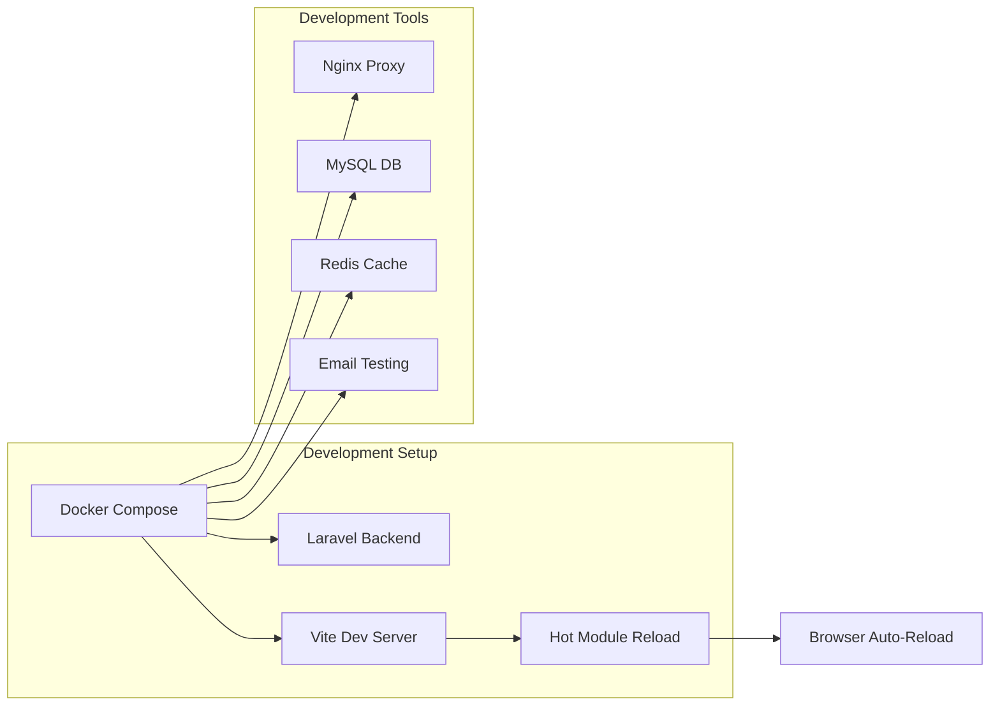
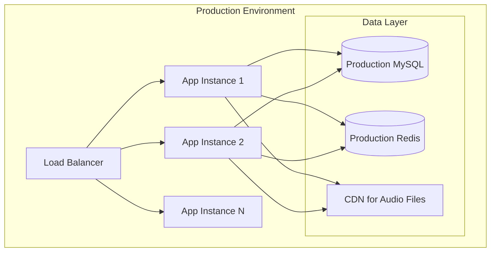

# Laravel Audio Streaming Platform - High-Level Architecture

## 1. System Overview

This is a professional audio streaming platform built with Laravel + Inertia.js + Vue.js, designed to provide SoundCloud-like functionality with embeddable players. The application runs entirely in Docker containers for consistent development and deployment.

### Core Capabilities
- **Progressive Audio Streaming**: Instant playback with HTTP range request support
- **Embeddable Players**: Iframe-based players for external websites
- **Global Audio Management**: Cross-frame audio control using BroadcastChannel API
- **Professional UI**: SoundCloud-inspired responsive design
- **Real-time Features**: Live episode updates and streaming controls

## 2. Overall System Architecture

```mermaid
graph TB
    subgraph "Client Layer"
        Browser[Web Browser]
        Embed[Embedded Players]
    end
    
    subgraph "Load Balancer"
        Nginx[Nginx Reverse Proxy]
    end
    
    subgraph "Application Layer"
        Laravel[Laravel Application<br/>PHP 8.4 + FPM]
        Vite[Vite Dev Server<br/>Node.js]
    end
    
    subgraph "Data Layer"
        MySQL[(MySQL 8.0<br/>Database)]
        Redis[(Redis<br/>Cache & Sessions)]
        Files[Audio Files<br/>Static Storage]
        JSON[Episodes Metadata<br/>JSON Storage)]
    end
    
    subgraph "Development Tools"
        MailHog[MailHog<br/>Email Testing]
    end
    
    Browser --> Nginx
    Embed --> Nginx
    Nginx --> Laravel
    Nginx --> Vite
    Laravel --> MySQL
    Laravel --> Redis
    Laravel --> Files
    Laravel --> JSON
    Laravel --> MailHog
```

## 3. Docker Container Architecture

### 3.1 Container Services

| Service | Image | Purpose | Ports |
|---------|-------|---------|-------|
| **app** | Custom PHP 8.4-FPM | Laravel application backend | Internal |
| **nginx** | nginx:alpine | Web server & reverse proxy | 80:80 |
| **mysql** | mysql:8.0 | Primary database | 3306:3306 |
| **redis** | redis:alpine | Cache & session storage | 6379:6379 |
| **node** | node:current-alpine | Vite development server | 5179:5179, 5180:5180 |
| **mailhog** | mailhog/mailhog | Email testing service | 8025:8025 |

### 3.2 Container Communication



## 4. Backend Architecture (Laravel)

### 4.1 Controller Layer



### 4.2 Key Controllers

| Controller | Responsibility | Key Methods |
|------------|----------------|-------------|
| **EpisodeController** | Episode management & API | `index()`, `show()`, `api()` |
| **AudioStreamController** | Audio streaming with range requests | `stream()`, `handleRangeRequest()` |
| **EmbedController** | Embeddable player generation | `show()`, `generateEmbedCode()` |
| **Auth Controllers** | User authentication (Fortify) | Login, Register, 2FA |

### 4.3 Audio Streaming Infrastructure



## 5. Frontend Architecture (Vue.js + Inertia.js)

### 5.1 Application Structure



### 5.2 Audio Management System



## 6. Data Architecture

### 6.1 Data Storage Strategy



### 6.2 Episode Data Model

```json
{
  "episodes": [
    {
      "id": 1,
      "title": "Episode 1 - Tech Weekly",
      "filename": "first-episode.m4a",
      "url": "/audios/first-episode.m4a",
      "duration": "45:30",
      "description": "Weekly tech discussion",
      "published_at": "2024-01-15"
    }
  ]
}
```

## 7. Progressive Streaming Implementation

### 7.1 Streaming Flow



### 7.2 Audio Player Configuration

```typescript
// useAudioPlayer.ts - Progressive streaming setup
const initAudio = (src: string) => {
  audioElement.value = new Audio()
  audioElement.value.preload = 'none'        // Load only on demand
  audioElement.value.crossOrigin = 'anonymous' // CORS support
  audioElement.value.src = src
  
  // Event listeners for streaming states
  audioElement.value.addEventListener('loadstart', () => {
    state.isLoading = true
  })
  
  audioElement.value.addEventListener('progress', () => {
    // Update buffered ranges for smart seeking
    updateBufferedRanges()
  })
}
```

## 8. Embeddable Player System

### 8.1 Embed Architecture

```mermaid
graph TD
    subgraph "External Website"
        ExtPage[External Page]
        Iframe[Iframe Element]
    end
    
    subgraph "Streaming Platform"
        EmbedRoute[/embed/{id}]
        EmbedController[EmbedController]
        EmbedView[embed.blade.php]
        EmbedPlayer[EmbedPlayer.vue]
    end
    
    subgraph "Global Audio Control"
        BroadcastChannel[BroadcastChannel API]
        AudioManager[Global Audio Manager]
    end
    
    ExtPage --> Iframe
    Iframe --> EmbedRoute
    EmbedRoute --> EmbedController
    EmbedController --> EmbedView
    EmbedView --> EmbedPlayer
    EmbedPlayer --> BroadcastChannel
    BroadcastChannel --> AudioManager
```

### 8.2 Cross-Frame Communication

```javascript
// Global Audio Manager - Cross-frame control
const channel = new BroadcastChannel('audio-control')

// When any player starts
channel.postMessage({
  type: 'AUDIO_STARTED',
  playerId: 'player-123',
  episodeId: 1
})

// All other players receive and pause
channel.addEventListener('message', (event) => {
  if (event.data.type === 'AUDIO_STARTED' && 
      event.data.playerId !== currentPlayerId) {
    pauseCurrentAudio()
  }
})
```

## 9. Development Workflow

### 9.1 Development Environment



### 9.2 Development Commands

```bash
# Start development environment
docker compose up -d

# Frontend development (with HMR)
docker compose exec node npm run dev

# Backend development
docker compose exec app php artisan serve

# Database operations
docker compose exec app php artisan migrate
docker compose exec app php artisan db:seed
```

## 10. Security & Performance

### 10.1 Security Measures

- **CORS Configuration**: Proper cross-origin headers for audio streaming
- **File Validation**: Basename validation to prevent directory traversal
- **Authentication**: Laravel Fortify for secure user management
- **Input Sanitization**: XSS protection for embed code generation

### 10.2 Performance Optimizations

- **Progressive Streaming**: Instant playback without full download
- **HTTP Range Requests**: Efficient seeking and bandwidth usage
- **Redis Caching**: Session and application data caching
- **Asset Optimization**: Vite bundling and code splitting
- **Nginx Proxy**: Static file serving and request optimization

## 11. Deployment Architecture

### 11.1 Production Considerations



### 11.2 Scalability Features

- **Horizontal Scaling**: Multiple Laravel instances behind load balancer
- **CDN Integration**: Audio files served from CDN for global performance
- **Database Optimization**: MySQL with proper indexing and query optimization
- **Cache Strategy**: Redis for session management and application caching
- **Asset Delivery**: Optimized static asset delivery through CDN

## 12. Technology Stack Summary

### Backend Stack
- **Framework**: Laravel 11.x
- **Runtime**: PHP 8.4 with FPM
- **Database**: MySQL 8.0
- **Cache**: Redis
- **Authentication**: Laravel Fortify
- **Web Server**: Nginx (Alpine)

### Frontend Stack
- **Framework**: Vue.js 3.x (Composition API)
- **SPA Solution**: Inertia.js
- **Language**: TypeScript
- **Build Tool**: Vite
- **Styling**: Tailwind CSS
- **Runtime**: Node.js (Alpine)

### Infrastructure
- **Containerization**: Docker & Docker Compose
- **Development**: Hot Module Replacement (HMR)
- **Email Testing**: MailHog
- **Audio Streaming**: Progressive streaming with HTTP range requests
- **Cross-Frame Communication**: BroadcastChannel API

This architecture provides a robust, scalable foundation for a professional audio streaming platform comparable to SoundCloud and Spotify, with modern development practices and deployment-ready containerization.