# High-Level Architecture - Laravel Audio Streaming Platform

## 1. System Overview

This document outlines the high-level architecture of a professional audio streaming platform built with Laravel, Inertia.js, and Vue.js, featuring embeddable players and progressive streaming capabilities.

<div align="center">

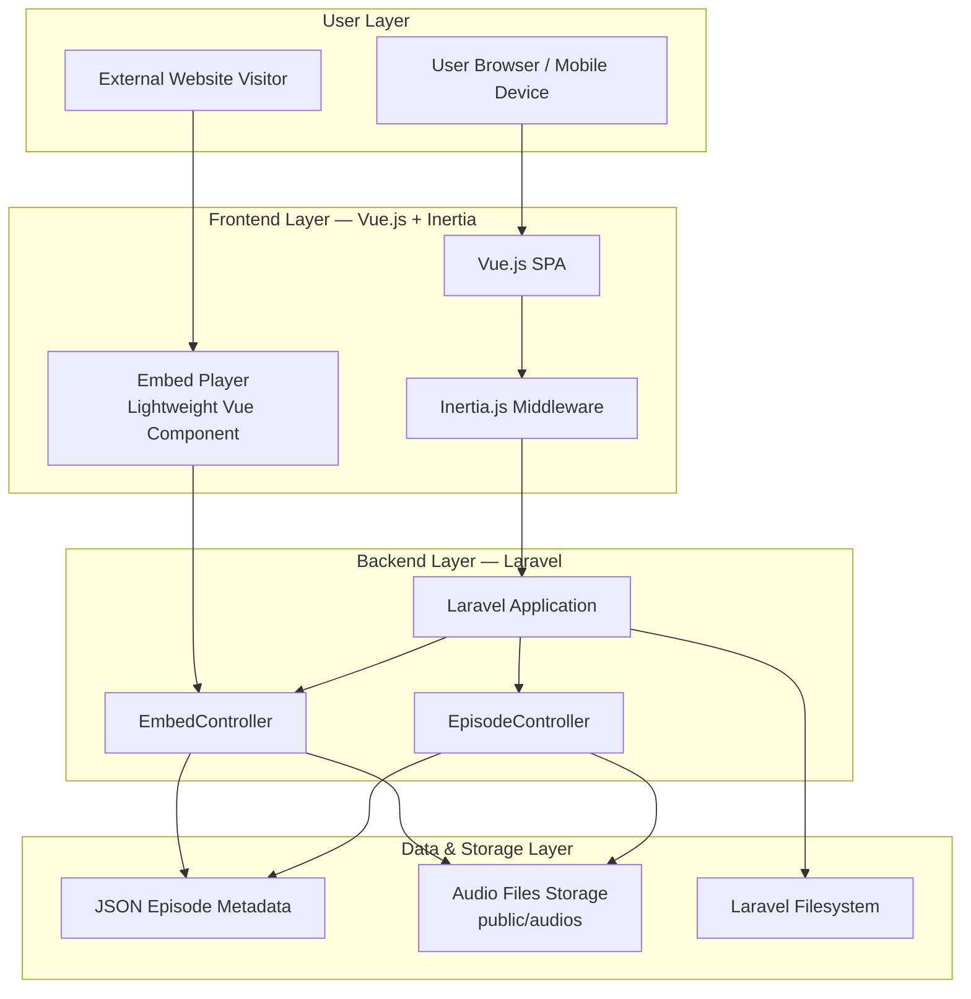

</div>

## 2. Backend API Architecture

### 2.1 Laravel Controllers Structure

<div align="center">

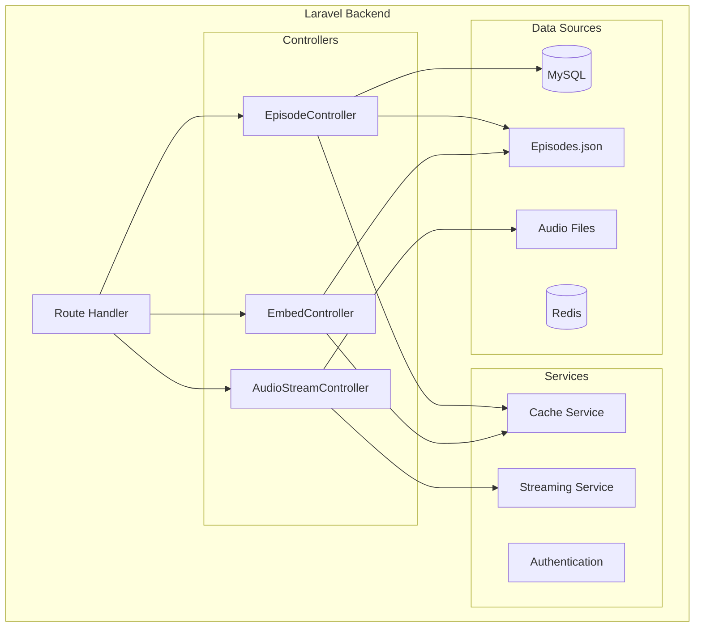

</div>

### 2.2 API Endpoints Design

| Endpoint                    | Method | Controller                                 | Purpose                         |
| --------------------------- | ------ | ------------------------------------------ | ------------------------------- |
| `/`                         | GET    | EpisodeController\@index                   | Home page with episode list     |
| `/api/episodes`             | GET    | EpisodeController\@apiIndex                | Get all episodes (API)          |
| `/api/episodes/{id}`        | GET    | EpisodeController\@show                    | Get specific episode            |
| `/api/stream/{filename}`    | GET    | AudioStreamController\@stream              | Stream audio with range support |
| `/api/episodes/{id}/stream` | GET    | AudioStreamController\@getEpisodeStreamUrl | Get streaming URL for episode   |
| `/embed/{id}`               | GET    | EmbedController\@show                      | Embed player page               |
| `/api/embed/{id}/code`      | GET    | EmbedController\@generateEmbedCode         | Generate embed HTML code        |

### 2.3 Backend Data Flow

<div align="center">

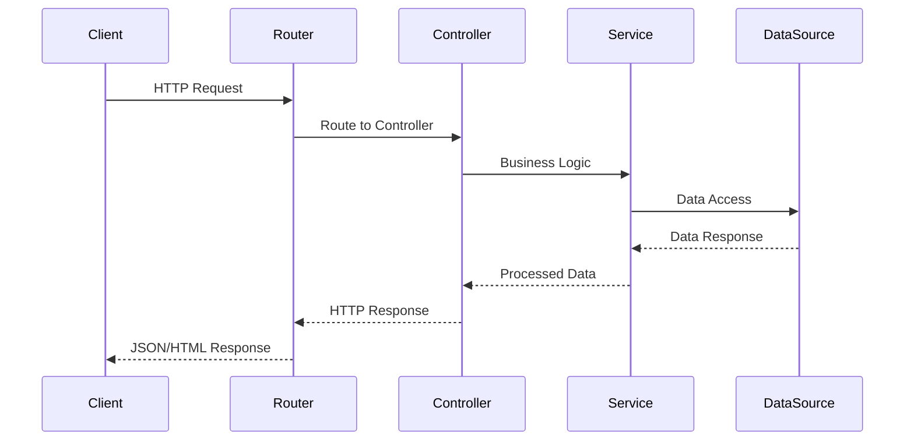

</div>

## 3. Frontend Architecture

### 3.1 Vue.js Component Hierarchy

<div align="center">

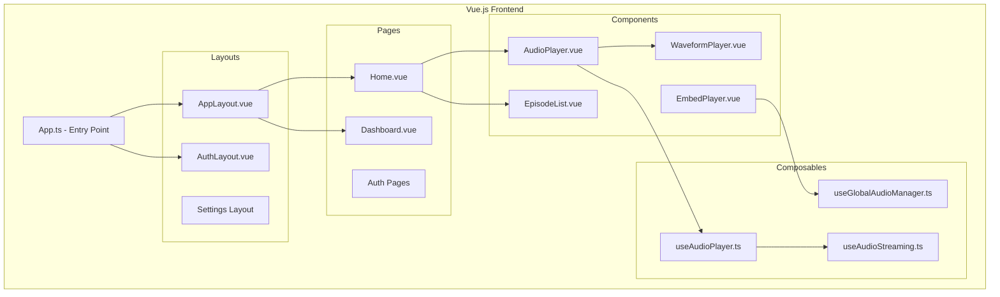

</div>

### 3.2 State Management Pattern

<div align="center">

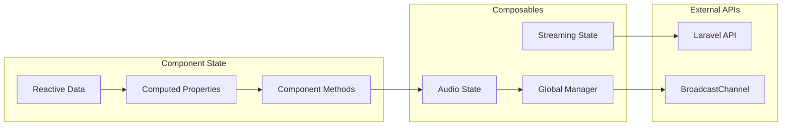

</div>

### 3.3 Frontend Data Flow

<div align="center">

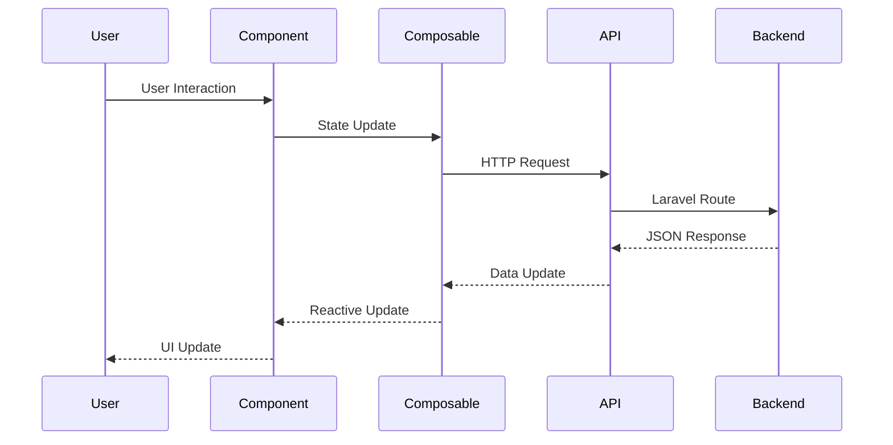

</div>

## 4. Embed System Architecture

### 4.1 Embed Player Integration

<div align="center">

```mermaid
graph TD
    subgraph "External Website"
        IFRAME[Iframe Container]
        EMBED_CODE[Generated Embed Code]
    end
    
    subgraph "Embed System"
        EMBED_ROUTE[/embed/{id}]
        EMBED_CONTROLLER[EmbedController]
        EMBED_VIEW[embed.blade.php]
        EMBED_PLAYER[EmbedPlayer.vue]
    end
    
    subgraph "Global Audio Manager"
        BROADCAST[BroadcastChannel API]
        GLOBAL_STATE[Global Audio State]
    end
    
    subgraph "Audio Streaming"
        STREAM_API[Streaming API]
        AUDIO_FILES[Audio Files]
    end
    
    EMBED_CODE --> IFRAME
    IFRAME --> EMBED_ROUTE
    EMBED_ROUTE --> EMBED_CONTROLLER
    EMBED_CONTROLLER --> EMBED_VIEW
    EMBED_VIEW --> EMBED_PLAYER
    EMBED_PLAYER --> BROADCAST
    EMBED_PLAYER --> STREAM_API
    STREAM_API --> AUDIO_FILES
```

</div>

### 4.2 Cross-Frame Communication

<div align="center">

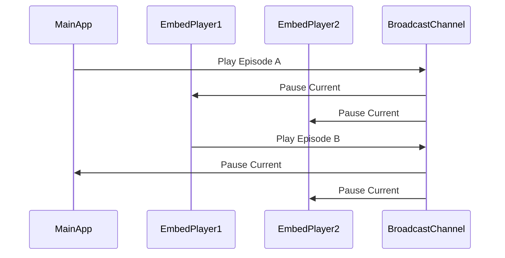

</div>

### 4.3 Embed Code Generation

```typescript
// Embed Code Structure
interface EmbedCode {
    embedUrl: string;          // /embed/{id}
    embedCode: string;         // <iframe> HTML
    episode: Episode;          // Episode data
    dimensions: {
        width: string;         // "100%"
        height: string;        // "120px"
    };
    features: {
        autoplay: boolean;     // false by default
        controls: boolean;     // true
        waveform: boolean;     // true
    };
}
```

## 5. API Design Patterns

### 5.1 RESTful API Structure

<div align="center">

```mermaid
graph TD
    subgraph "API Layers"
        ROUTES[Route Definitions]
        CONTROLLERS[Controller Layer]
        SERVICES[Service Layer]
        REPOSITORIES[Repository Layer]
    end
    
    subgraph "Response Patterns"
        JSON_API[JSON API Format]
        STREAMING[Streaming Response]
        HTML[HTML Response]
    end
    
    subgraph "Authentication"
        GUEST[Guest Access]
        AUTH[Authenticated]
        API_KEY[API Key (Future)]
    end
    
    ROUTES --> CONTROLLERS
    CONTROLLERS --> SERVICES
    SERVICES --> REPOSITORIES
    
    CONTROLLERS --> JSON_API
    CONTROLLERS --> STREAMING
    CONTROLLERS --> HTML
    
    ROUTES --> GUEST
    ROUTES --> AUTH
    ROUTES --> API_KEY
```

</div>

### 5.2 Audio Streaming API

<div align="center">

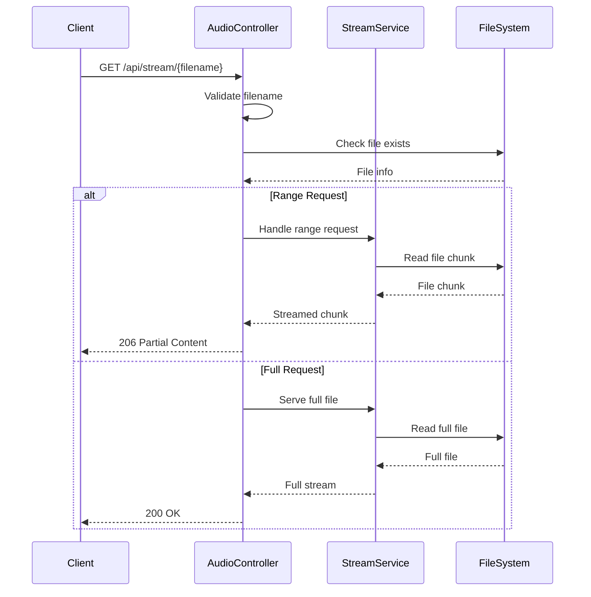

</div>

### 5.3 API Response Formats

```typescript
// Episode API Response
interface EpisodeResponse {
    id: number;
    title: string;
    filename: string;
    url: string;
    duration: string;
    published_date: string;
    description?: string;
}

// Streaming API Response
interface StreamResponse {
    episode: EpisodeResponse;
    stream_url: string;
    supports_range: boolean;
}

// Embed Code Response
interface EmbedResponse {
    embedCode: string;
    embedUrl: string;
    episode: EpisodeResponse;
}
```

## 6. Data Flow Architecture

### 6.1 Complete System Data Flow

<div align="center">

```mermaid
graph TB
    subgraph "User Interactions"
        WEB_USER[Web User]
        EMBED_USER[Embed User]
        API_USER[API User]
    end
    
    subgraph "Frontend Processing"
        VUE_APP[Vue Application]
        EMBED_PLAYER[Embed Player]
        COMPOSABLES[Composables]
    end
    
    subgraph "Backend Processing"
        LARAVEL[Laravel Backend]
        CONTROLLERS[Controllers]
        MIDDLEWARE[Middleware]
    end
    
    subgraph "Data Storage"
        MYSQL[(MySQL)]
        REDIS[(Redis)]
        FILES[Audio Files]
        JSON[Episodes JSON]
    end
    
    subgraph "External Services"
        CDN[CDN (Future)]
        ANALYTICS[Analytics (Future)]
    end
    
    WEB_USER --> VUE_APP
    EMBED_USER --> EMBED_PLAYER
    API_USER --> LARAVEL
    
    VUE_APP --> COMPOSABLES
    EMBED_PLAYER --> COMPOSABLES
    COMPOSABLES --> LARAVEL
    
    LARAVEL --> CONTROLLERS
    CONTROLLERS --> MIDDLEWARE
    MIDDLEWARE --> MYSQL
    MIDDLEWARE --> REDIS
    MIDDLEWARE --> FILES
    MIDDLEWARE --> JSON
    
    CONTROLLERS --> CDN
    CONTROLLERS --> ANALYTICS
```

</div>

### 6.2 Audio Streaming Data Flow

<div align="center">

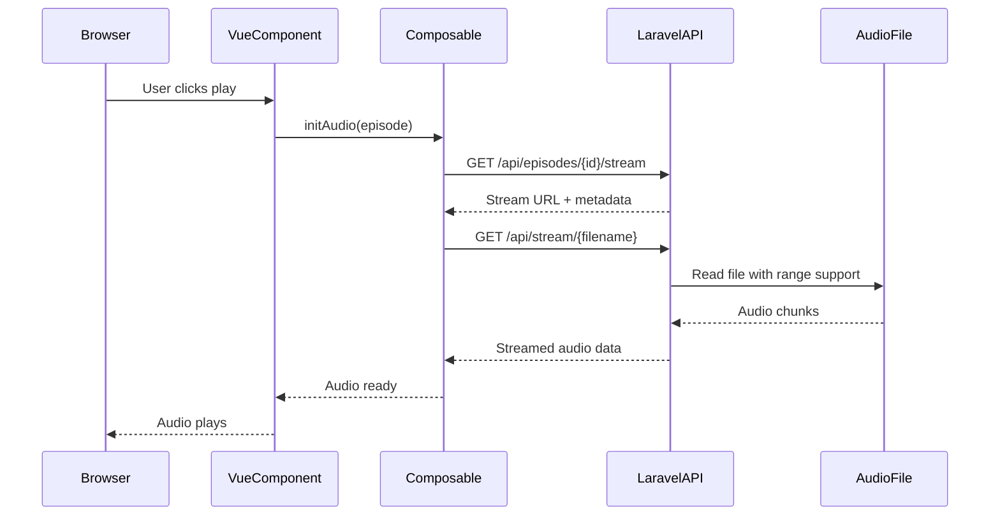

</div>

## 7. Integration Points

### 7.1 Frontend-Backend Integration

<div align="center">

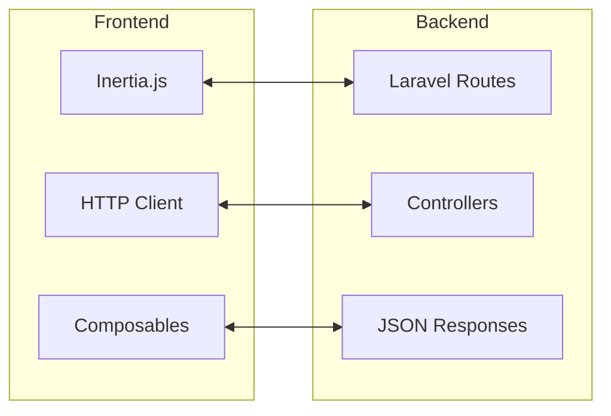

</div>

### 7.2 Embed Integration Points

<div align="center">

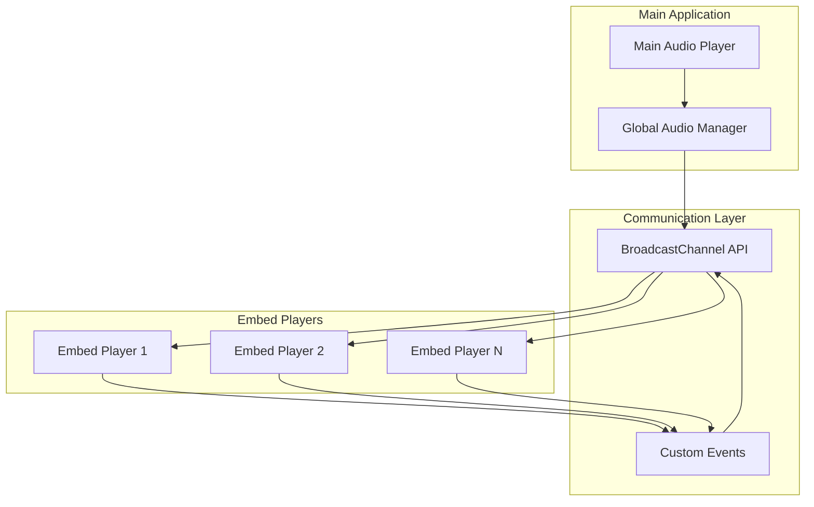

</div>

### 7.3 Development Integration

<div align="center">

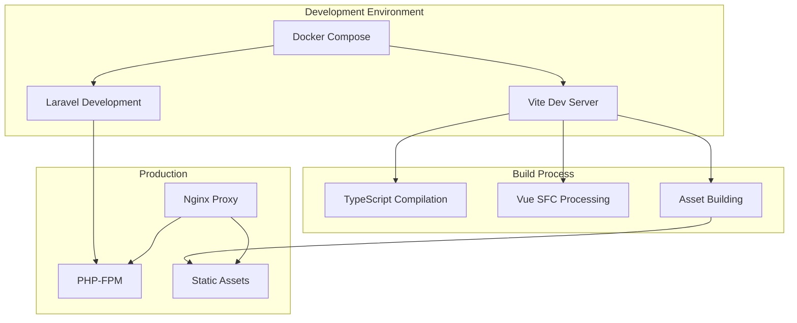

</div>

## 8. Security & Performance Considerations

### 8.1 Security Architecture

* **Input Validation**: All file paths validated to prevent directory traversal

* **CORS Configuration**: Proper cross-origin headers for embed functionality

* **Authentication**: Laravel Fortify for user authentication

* **File Access Control**: Audio files served through controlled endpoints

* **XSS Protection**: Vue.js template escaping and CSP headers

### 8.2 Performance Optimizations

* **Progressive Streaming**: Audio starts playing before full download

* **HTTP Range Requests**: Efficient seeking and bandwidth usage

* **Redis Caching**: Episode metadata and user sessions cached

* **Asset Optimization**: Vite for optimized frontend builds

* **Nginx Proxy**: Static file serving and request optimization

## 9. Scalability Considerations

### 9.1 Horizontal Scaling Points

* **Load Balancer**: Multiple Laravel instances behind load balancer

* **CDN Integration**: Audio files served from CDN for global distribution

* **Database Scaling**: Read replicas for episode data

* **Cache Scaling**: Redis cluster for distributed caching

* **Microservices**: Audio processing as separate service

### 9.2 Future Architecture Enhancements

* **API Gateway**: Centralized API management and rate limiting

* **Message Queue**: Background processing for audio uploads

* **Search Service**: Elasticsearch for episode search functionality

* **Analytics Service**: Real-time streaming analytics

* **Mobile Apps**: Native mobile applications using same API

