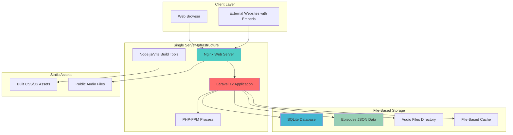
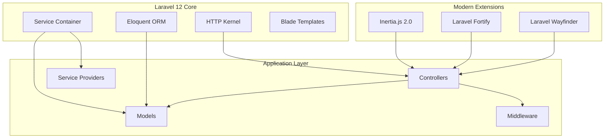
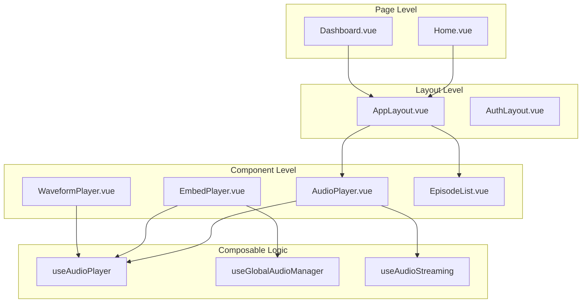
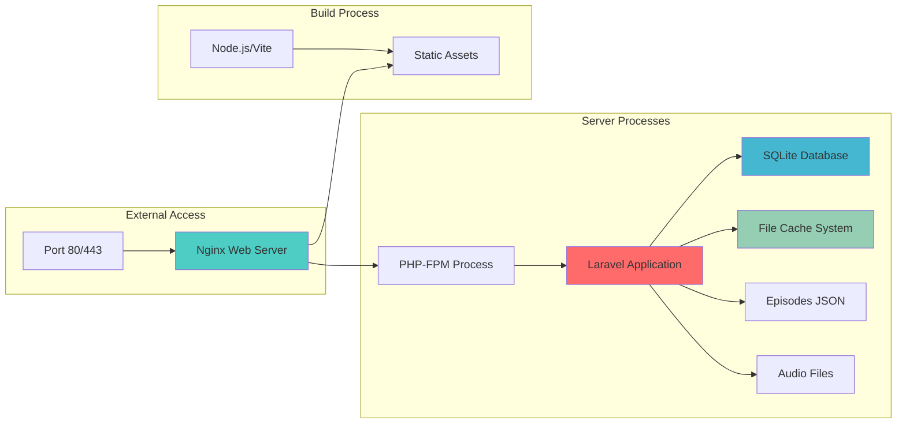
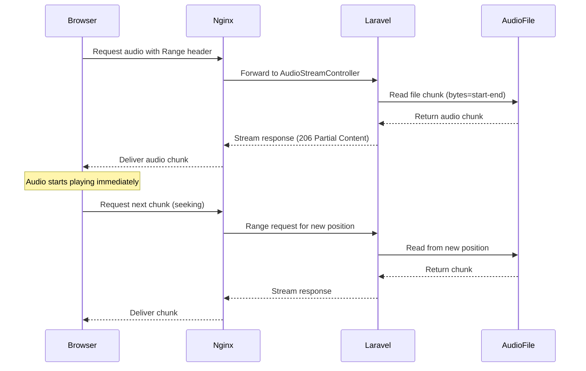
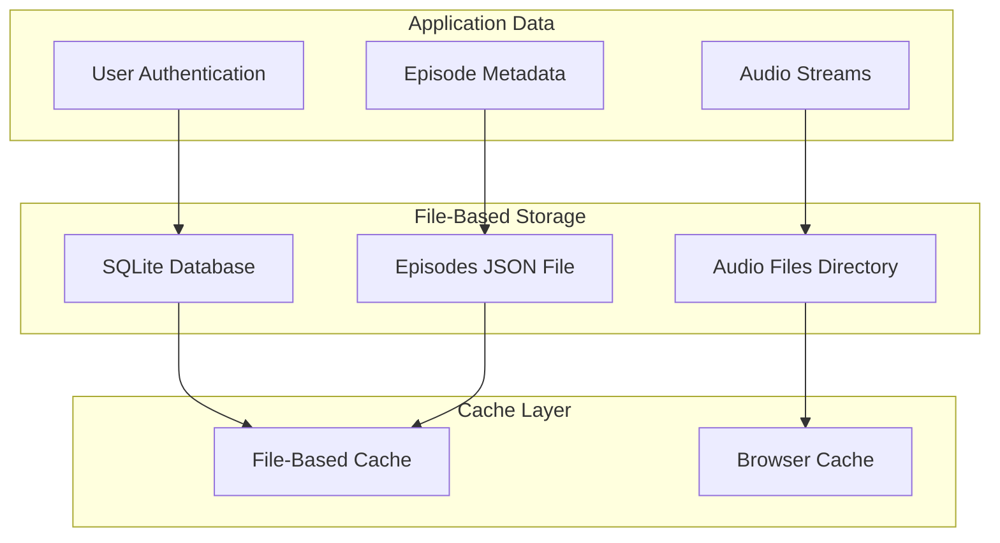
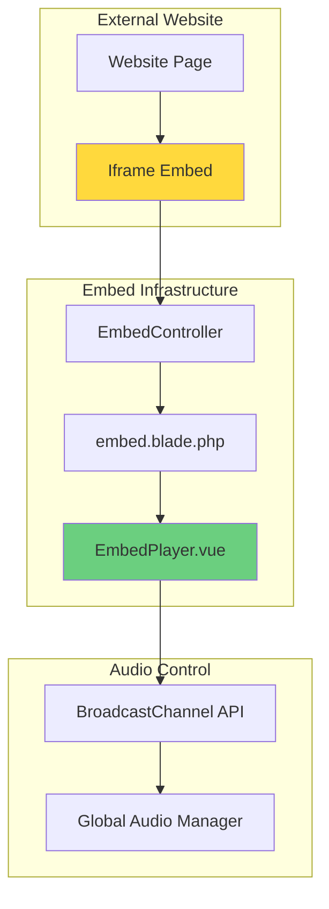
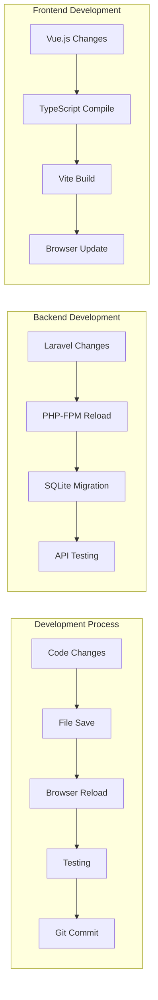
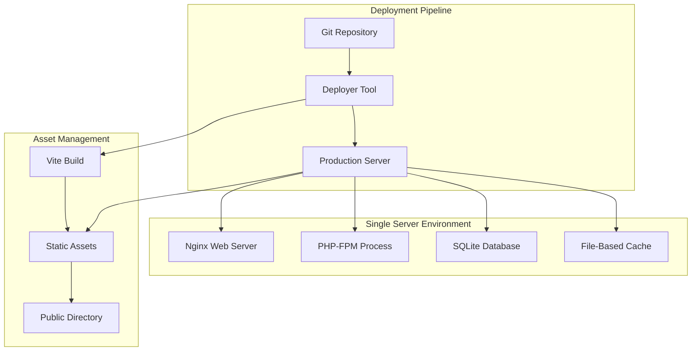
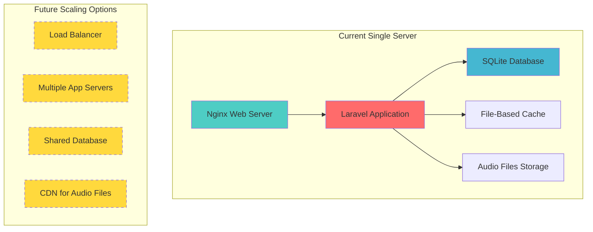

# Laravel 12 Audio Streaming Platform - Complete Architecture

## 1. System Overview

This is a professional audio streaming platform built with Laravel 12, featuring SoundCloud-like functionality with embeddable players, progressive streaming, and modern web technologies deployed on a single server.

### Key Features
- **Progressive Audio Streaming** with HTTP range request support
- **Embeddable Players** for external website integration
- **Global Audio Manager** ensuring single-player control across frames
- **Waveform Visualization** and professional UI design
- **Single Server Deployment** with file-based storage
- **Production-ready** with automated deployment tools



## 2. Laravel 12 Framework Architecture

### 2.1 Framework Specifications
- **Laravel Version**: 12.0+ (latest major release)
- **PHP Version**: 8.2+ minimum requirement
- **Architecture Pattern**: MVC with modern enhancements
- **Key Dependencies**:
  - `inertiajs/inertia-laravel: ^2.0` - SPA functionality
  - `laravel/fortify: ^1.30` - Authentication system
  - `laravel/wayfinder: ^0.1.9` - Advanced routing

### 2.2 Laravel 12 New Features Utilized
- **Enhanced Performance**: Improved query optimization and caching
- **Modern PHP Features**: PHP 8.2+ type declarations and attributes
- **Improved Inertia Integration**: Better SSR and hydration support
- **Advanced Routing**: Wayfinder for complex route management



## 3. Application Structure

### 3.1 Backend Architecture

#### Controllers
```
app/Http/Controllers/
├── AudioStreamController.php    # HTTP range requests, progressive streaming
├── EpisodeController.php        # Episode management and API
├── EmbedController.php          # Embed player generation
├── Auth/                        # Authentication controllers
└── Settings/                    # User settings management
```

#### Key Controller Responsibilities

| Controller | Purpose | Key Methods |
|------------|---------|-------------|
| **AudioStreamController** | Audio streaming with range support | `stream()`, `handleRangeRequest()`, `getEpisodeStreamUrl()` |
| **EpisodeController** | Episode data management | `index()`, `show()`, `api()` |
| **EmbedController** | Embed player functionality | `show()`, `generateEmbedCode()` |

#### Models & Data Management
```
app/Models/
└── User.php                     # User authentication and management

database/
├── data/episodes.json           # Episode metadata storage
├── migrations/                  # Database schema
└── seeders/                     # Development data
```

### 3.2 Frontend Architecture

#### Vue.js 3 + TypeScript Structure
```
resources/js/
├── app.ts                       # Main application entry
├── ssr.ts                       # Server-side rendering
├── components/
│   ├── AudioPlayer.vue          # Main audio player component
│   ├── EmbedPlayer.vue          # Embeddable player
│   ├── WaveformPlayer.vue       # Waveform visualization
│   ├── EpisodeList.vue          # Episode listing
│   └── ui/                      # Reusable UI components
├── composables/
│   ├── useAudioPlayer.ts        # Audio playback logic
│   ├── useGlobalAudioManager.ts # Cross-frame audio control
│   └── useAudioStreaming.ts     # Streaming functionality
├── pages/
│   ├── Home.vue                 # Main homepage
│   ├── Dashboard.vue            # User dashboard
│   └── auth/                    # Authentication pages
└── layouts/
    ├── AppLayout.vue            # Main application layout
    └── AuthLayout.vue           # Authentication layout
```

#### Component Architecture


## 4. Single Server Infrastructure

### 4.1 Server Architecture
```yaml
# Single server deployment configuration
Server Components:
  nginx:        # Web server and reverse proxy
  php-fpm:      # Laravel 12 application (PHP 8.2+)
  sqlite:       # Lightweight database storage
  file-cache:   # File-based caching system
  node:         # Build tools (Vite for production builds)
```

### 4.2 Server Process Communication


### 4.3 File System Structure
- **Application Code**: `/var/www/laravel-streaming/` (application root)
- **SQLite Database**: `/var/www/laravel-streaming/database/database.sqlite`
- **Audio Files**: `/var/www/laravel-streaming/public/audios/`
- **Episodes Data**: `/var/www/laravel-streaming/storage/app/episodes.json`
- **File Cache**: `/var/www/laravel-streaming/storage/framework/cache/`

## 5. Audio Streaming System

### 5.1 Progressive Streaming Architecture


### 5.2 Audio Management Features

#### HTTP Range Request Support
```php
// AudioStreamController implementation
private function handleRangeRequest($filePath, $fileSize, $mimeType, $range)
{
    // Parse range header (e.g., "bytes=0-1023")
    // Validate range boundaries
    // Stream partial content with 206 status
    // Support seeking and progressive loading
}
```

#### Global Audio Manager
```typescript
// useGlobalAudioManager.ts
export function useGlobalAudioManager() {
    const channel = new BroadcastChannel('audio-control');
    
    // Ensure only one player active across all frames/tabs
    const pauseOtherPlayers = (currentPlayerId: string) => {
        channel.postMessage({
            type: 'pause-others',
            playerId: currentPlayerId
        });
    };
}
```

## 6. Database & Data Architecture

### 6.1 Data Storage Strategy


### 6.2 Data Models

#### Episode Data Structure
```json
{
  "episodes": [
    {
      "id": 1,
      "title": "Episode 1 - Madhu Sudhan Subedi Tech Weekly",
      "filename": "first-episode.m4a",
      "url": "/audios/first-episode.m4a",
      "duration": "45:30",
      "description": "Weekly tech discussion..."
    }
  ]
}
```

#### User Model (Laravel)
```php
class User extends Authenticatable
{
    use HasApiTokens, HasFactory, Notifiable, TwoFactorAuthenticatable;
    
    protected $fillable = ['name', 'email', 'password'];
    protected $hidden = ['password', 'remember_token'];
    protected $casts = ['email_verified_at' => 'datetime'];
}
```

## 7. Embed System Architecture

### 7.1 Embed Player Implementation


### 7.2 Cross-Frame Communication
```typescript
// Cross-frame audio control implementation
const audioChannel = new BroadcastChannel('audio-control');

// Listen for global pause commands
audioChannel.addEventListener('message', (event) => {
    if (event.data.type === 'pause-others' && 
        event.data.playerId !== currentPlayerId) {
        pauseCurrentPlayer();
    }
});
```

## 8. Development Workflow

### 8.1 Development Environment Setup
```bash
# Start development environment on single server
sudo systemctl start nginx
sudo systemctl start php8.2-fpm

# Services running:
# - Laravel app (PHP 8.2+ FPM)
# - Nginx web server (port 80/443)
# - SQLite database (file-based)
# - File-based caching
# - Node.js for build tools
```

### 8.2 Development Workflow


### 8.3 Build Process
```json
{
  "scripts": {
    "dev": "vite",
    "build": "vite build",
    "build:ssr": "vite build && vite build --ssr",
    "format": "prettier --write resources/",
    "lint": "eslint . --fix"
  }
}
```

## 9. Production Deployment

### 9.1 Deployment Architecture


### 9.2 Deployer Configuration
```php
// deploy.yml - Automated deployment setup
config:
  repository: 'https://github.com/madhusudhan1234/laravel-streaming.git'
  shared_files: ['.env']
  shared_dirs: ['storage', 'public/audios']
  
tasks:
  - deploy:prepare
  - deploy:vendors
  - artisan:migrate
  - artisan:config:cache
  - npm:install
  - npm:run:build
  - deploy:publish
```

## 10. Security & Performance

### 10.1 Security Measures
- **Input Validation**: Filename sanitization for audio streaming
- **CORS Configuration**: Controlled cross-origin access for embeds
- **Authentication**: Laravel Fortify with 2FA support
- **File Access Control**: Restricted audio file access patterns

### 10.2 Performance Optimizations
- **Progressive Streaming**: Instant audio playback without full download
- **File-Based Caching**: Session and application data caching using filesystem
- **Nginx Proxy**: Static file serving and request optimization
- **Asset Optimization**: Vite build process with code splitting

## 11. Scalability Considerations

### 11.1 Single Server Scaling


### 11.2 Future Enhancements
- **CDN Integration**: Global audio file distribution
- **Microservices**: Separate audio processing service
- **Real-time Features**: WebSocket integration for live streaming
- **Analytics**: User behavior and streaming analytics
- **Mobile Apps**: React Native or Flutter applications

## 12. Technology Stack Summary

### 12.1 Backend Stack
- **Framework**: Laravel 12.0+
- **Language**: PHP 8.2+
- **Database**: SQLite (file-based)
- **Cache**: File-based caching
- **Web Server**: Nginx
- **Process Manager**: PHP-FPM

### 12.2 Frontend Stack
- **Framework**: Vue.js 3 with Composition API
- **Language**: TypeScript
- **SPA Solution**: Inertia.js 2.0
- **Build Tool**: Vite
- **Styling**: Tailwind CSS 4.0+
- **UI Components**: Shadcn/ui Vue

### 12.3 Development Tools
- **Containerization**: Docker Compose
- **Development Server**: Vite with HMR
- **Code Quality**: ESLint, Prettier, Laravel Pint
- **Testing**: PHPUnit, Laravel Testing
- **Deployment**: Deployer 7.5+

This Laravel 12 audio streaming platform represents a modern, scalable architecture that combines the latest web technologies to deliver a professional audio streaming experience comparable to industry leaders like SoundCloud and Spotify.