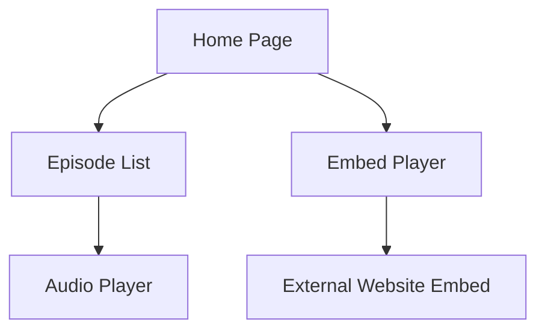
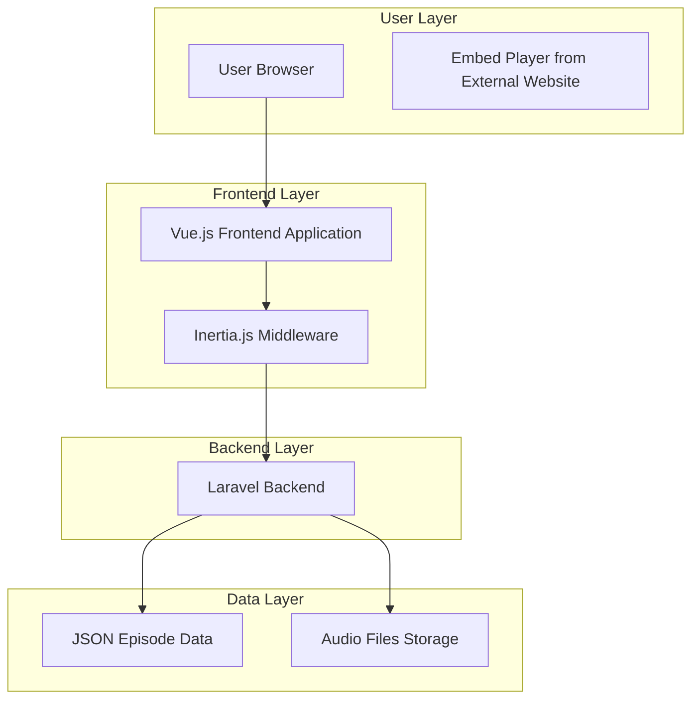

# Laravel Audio Streaming Application - Project Overview

## 1. Product Overview

A simple Laravel-based audio streaming platform featuring "Madhu Sudhan Subedi Tech Weekly" podcast episodes with Vue.js frontend and Inertia.js. The application provides basic audio streaming capabilities with embeddable players for external website integration.

The platform allows users to browse and stream audio episodes directly in the browser, with the ability to embed individual episodes on external websites.

## 2. Core Features

### 2.1 Feature Module

Our audio streaming application consists of the following main pages:

1. **Home Page**: Episode list with audio player
2. **Embed Player Page**: Lightweight embeddable audio player for external websites

### 2.2 Page Details

| Page Name    | Module Name        | Feature description                                                   |
| ------------ | ------------------ | --------------------------------------------------------------------- |
| Home Page    | Episode List       | Display all available episodes with titles and play buttons           |
| Home Page    | Audio Player       | Simple audio player with play/pause, progress bar, and volume control |
| Embed Player | Lightweight Player | Minimal audio player designed for embedding with basic controls       |

## 3. Core Process

### User Flow

Users can browse the homepage to view all available episodes and click on any episode to start streaming directly on the page.

### Embed Flow

External website owners can access embed codes for specific episodes and integrate them into their websites for seamless audio streaming.



## 4. User Interface Design

### 4.1 Design Style

* **Primary Colors**: Deep blue (#1e40af) and white (#ffffff)

* **Secondary Colors**: Light gray (#f3f4f6) and dark gray (#374151)

* **Button Style**: Rounded corners with subtle shadows and hover effects

* **Font**: Inter font family with 16px base size

* **Layout Style**: Card-based design with clean, modern aesthetic

* **Icons**: Heroicons for consistent iconography, music-related icons for audio controls

### 4.2 Page Design Overview

| Page Name    | Module Name        | UI Elements                                                          |
| ------------ | ------------------ | -------------------------------------------------------------------- |
| Home Page    | Episode List       | Simple list layout with episode titles and play buttons              |
| Home Page    | Audio Player       | Basic audio player with play/pause, progress bar, and volume control |
| Embed Player | Lightweight Player | Minimal design with essential controls, responsive width             |

### 4.3 Responsiveness

Desktop-first design with mobile-adaptive layout. Touch-optimized controls for mobile devices with larger tap targets and swipe gestures for audio scrubbing.

## 5. Technical Architecture

### 5.1 Technology Stack

* **Backend**: Laravel 11.x with PHP 8.4

* **Frontend**: Vue.js 3.x with Composition API

* **SPA Framework**: Inertia.js for seamless page transitions

* **Styling**: Tailwind CSS for utility-first styling

* **Audio Processing**: HTML5 Audio API with custom Vue components

* **Data Storage**: JSON file for episode metadata, Laravel filesystem for audio files

### 5.2 Architecture Design



### 5.3 Route Definitions

| Route         | Purpose                                            |
| ------------- | -------------------------------------------------- |
| /             | Home page displaying episode list and audio player |
| /embed/{id}   | Embeddable audio player for external websites      |
| /api/episodes | JSON API endpoint for episode data                 |

### 5.4 Data Model

#### Episode Data Structure (JSON)

```json
{
  "episodes": [
    {
      "id": 1,
      "title": "Episode 1 - Madhu Sudhan Subedi Tech Weekly",
      "filename": "first-episode.m4a",
      "duration": "00:45:30",
      "file_size": "42.5MB",
      "format": "m4a",
      "published_date": "2024-01-01",
      "description": "Weekly tech discussion covering latest trends",
      "url": "/audios/first-episode.m4a"
    }
  ]
}
```

## 6. Development Implementation Plan

### Phase 1: Core Infrastructure

1. Set up Laravel routes and controllers
2. Create JSON episode data structure
3. Implement basic Vue.js audio player component
4. Design simple layout with Tailwind CSS

### Phase 2: Audio Streaming Features

1. Develop episode listing functionality
2. Create audio player with basic controls
3. Add audio controls (play, pause, seek, volume)

### Phase 3: Embed Functionality

1. Create lightweight embeddable player
2. Implement iframe-based embedding
3. Add embed code generation

## 7. File Structure Overview

```
├── app/Http/Controllers/
│   ├── EpisodeController.php
│   └── EmbedController.php
├── resources/js/
│   ├── components/
│   │   ├── AudioPlayer.vue
│   │   └── EmbedPlayer.vue
│   └── pages/
│       └── Home.vue
├── public/audios/ (existing audio files)
├── storage/app/
│   └── episodes.json
└── routes/web.php
```

## 8. Key Features Summary

* **29 Episodes Available**: Complete collection from first episode to twenty-nine episode

* **Multiple Audio Formats**: Support for both MP3 and M4A formats

* **Simple Design**: Clean and minimal interface

* **Embeddable Players**: Easy integration for external websites

* **JSON-Based Management**: Simple episode metadata management

* **Laravel + Vue.js**: Modern, maintainable technology stack

